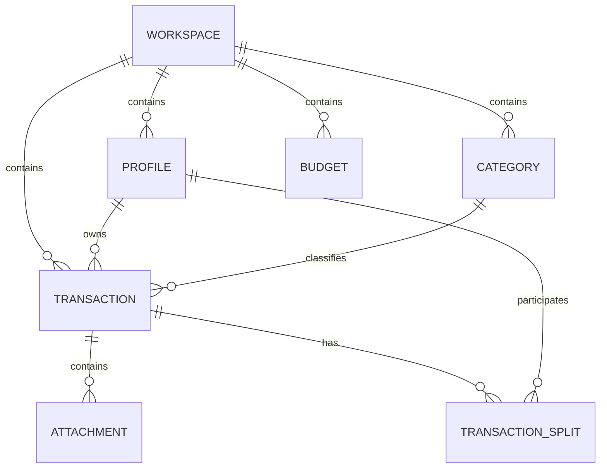

# Database Design

> Designing a scalable, local-first database architecture for Summa.

---

# Table of Contents

- Purpose
- Design Goals
- Database Philosophy
- Storage Strategy
- Naming Conventions
- Entity Overview
- Entity Relationships
- Core Entities
- Synchronization Fields
- Indexing Strategy
- Soft Delete Strategy
- Migration Strategy
- Future Expansion

---

# Purpose

This document defines the database architecture used throughout the Summa ecosystem.

The mobile application stores all data locally using SQLite.

Future phases introduce synchronization with a PostgreSQL backend while maintaining compatibility with the local schema.

---

# Database Philosophy

The database should be:

- Simple
- Predictable
- Extensible
- Offline-first
- Synchronization-friendly

The database is the source of truth.

The UI is only a representation of database state.

---

# Design Goals

The schema should support:

- Multiple local profiles
- Personal finances
- Shared finances
- Categories
- Budgets
- Statistics
- Imports
- OCR
- Synchronization
- Future cloud support

without requiring breaking changes.

---

# Storage Strategy

Phase 1

SQLite

↓

drift

Future

SQLite

↓

Sync Engine

↓

REST API

↓

PostgreSQL

Both databases should share nearly identical schemas.

---

# Naming Conventions

Tables

snake_case

Examples

profiles

transactions

categories

budgets

Attachments

Columns

snake_case

Examples

created_at

updated_at

profile_id

category_id

deleted_at

Primary Keys

UUID

Never auto-increment integers.

Reason:

UUIDs simplify synchronization between devices.

---

# Common Fields

Every entity contains the following synchronization-friendly fields:

| Field | Type | Description |
|-------|------|-------------|
| id | UUID | Client-generated, globally unique. Never auto-increment. |
| created_at | DATETIME | UTC timestamp of creation |
| updated_at | DATETIME | UTC timestamp of last modification |
| deleted_at | DATETIME | Nullable. Soft-delete timestamp. Null means active. |
| version | INTEGER | Starts at 1, incremented on every modification. Used for optimistic concurrency. |
| sync_status | TEXT | `local`, `pending`, `synced`, `conflict` |
| device_id | UUID | Identifies the device that created or last modified the record |

**Note:** In Phase 1 (local-only), `version`, `sync_status`, and `device_id` are present in the schema for forward compatibility but are not actively used by any synchronization logic. They become meaningful when the Sync Engine is introduced in Phase 3.

---

# Entity Overview

```

Workspace

│

├── Profiles

│

├── Categories

│

├── Transactions

│   └── TransactionSplits

│

├── Budgets

│

└── Attachments

```

Every financial entity belongs to exactly one Workspace. A Workspace has one or more Profiles. Transactions, Categories and Budgets are scoped to a Workspace and optionally to a specific Profile within that Workspace.

---

# Entity Relationship Diagram



---

# Entity: Workspace

Represents a shared financial space.

A Workspace is the top-level organizational unit. Every financial entity belongs to exactly one Workspace. In local-only mode (Phase 1), a single Workspace is created automatically for each device. When synchronization is introduced (Phase 3), the same Workspace can be accessed across multiple devices and shared with other users.

Fields

| Column | Type | Description |
|---------|------|-------------|
| id | UUID | Client-generated |
| name | TEXT | Display name |
| created_at | DATETIME | UTC |
| updated_at | DATETIME | UTC |
| deleted_at | DATETIME | Nullable, soft delete |
| version | INTEGER | Optimistic concurrency, starts at 1 |
| sync_status | TEXT | `local`, `pending`, `synced`, `conflict` |
| device_id | UUID | Origin device |

---

# Entity: Profile

Represents one member identity within a Workspace.

A Profile belongs to a single Workspace. In local-only mode, the user creates Profiles to represent themselves, their family or their household. When synchronization is enabled, each human user has one Account and may be a member of multiple Workspaces, each with their own Profile.

Fields

| Column | Type | Description |
|---------|------|-------------|
| id | UUID | Client-generated |
| workspace_id | UUID | FK → workspace |
| name | TEXT | Display name |
| type | TEXT | `personal`, `household` |
| currency | TEXT | ISO 4217 code, e.g. `USD`, `EUR`, `RSD` |
| is_default | INTEGER | 1 if this is the default profile, 0 otherwise |
| created_at | DATETIME | UTC |
| updated_at | DATETIME | UTC |
| deleted_at | DATETIME | Nullable, soft delete |
| version | INTEGER | Optimistic concurrency, starts at 1 |
| sync_status | TEXT | `local`, `pending`, `synced`, `conflict` |
| device_id | UUID | Origin device |

---

# Entity: Category

Represents expense or income categories.

Examples

Food

Transport

Salary

Entertainment

Fields

| Column | Type | Description |
|---------|------|-------------|
| id | UUID | Client-generated |
| workspace_id | UUID | FK → workspace |
| profile_id | UUID | FK → profile, nullable if category is workspace-wide |
| name | TEXT | Display name |
| icon | TEXT | Icon identifier |
| color | TEXT | Hex color, e.g. `#2C3E50` |
| type | TEXT | `expense`, `income` |
| is_default | INTEGER | 1 if seeded system category, 0 if user-created |
| sort_order | INTEGER | User-defined ordering |
| created_at | DATETIME | UTC |
| updated_at | DATETIME | UTC |
| deleted_at | DATETIME | Nullable, soft delete |
| version | INTEGER | Optimistic concurrency, starts at 1 |
| sync_status | TEXT | `local`, `pending`, `synced`, `conflict` |
| device_id | UUID | Origin device |

---

# Entity: Transaction

The central entity of the application.

All monetary amounts are stored as integer minor units (e.g. cents). A value of `125050` with currency `USD` represents `$1,250.50`.

Fields

| Column | Type | Description |
|---------|------|-------------|
| id | UUID | Client-generated |
| workspace_id | UUID | FK → workspace |
| profile_id | UUID | FK → profile |
| category_id | UUID | FK → category, nullable |
| amount_minor | INTEGER | Amount in minor units, always positive |
| currency | TEXT | ISO 4217 code |
| transaction_type | TEXT | `expense`, `income`, `transfer` |
| note | TEXT | Nullable, user note |
| merchant | TEXT | Nullable, merchant name |
| occurred_at | DATETIME | UTC, when the transaction occurred |
| created_at | DATETIME | UTC |
| updated_at | DATETIME | UTC |
| deleted_at | DATETIME | Nullable, soft delete |
| version | INTEGER | Optimistic concurrency, starts at 1 |
| sync_status | TEXT | `local`, `pending`, `synced`, `conflict` |
| device_id | UUID | Origin device |

---

Transaction Types

- Expense
- Income
- Transfer

Future:

- Adjustment

---

# Entity: Budget

Represents spending limits.

Fields

| Column | Type | Description |
|---------|------|-------------|
| id | UUID | Client-generated |
| workspace_id | UUID | FK → workspace |
| profile_id | UUID | FK → profile |
| category_id | UUID | FK → category, nullable for overall budget |
| amount_minor | INTEGER | Budget limit in minor units |
| currency | TEXT | ISO 4217 code |
| period | TEXT | `weekly`, `monthly`, `yearly` |
| start_date | DATE | Budget period start |
| created_at | DATETIME | UTC |
| updated_at | DATETIME | UTC |
| deleted_at | DATETIME | Nullable, soft delete |
| version | INTEGER | Optimistic concurrency, starts at 1 |
| sync_status | TEXT | `local`, `pending`, `synced`, `conflict` |
| device_id | UUID | Origin device |

---

# Entity: Attachment

Stores references to files.

Examples

- Receipt image
- Invoice
- PDF

Fields

| Column | Type | Description |
|---------|------|-------------|
| id | UUID | Client-generated |
| workspace_id | UUID | FK → workspace |
| transaction_id | UUID | FK → transaction |
| file_name | TEXT | Original file name |
| mime_type | TEXT | e.g. `image/jpeg`, `application/pdf` |
| local_path | TEXT | Local file path |
| file_size | INTEGER | Size in bytes |
| created_at | DATETIME | UTC |
| updated_at | DATETIME | UTC |
| deleted_at | DATETIME | Nullable, soft delete |
| version | INTEGER | Optimistic concurrency, starts at 1 |
| sync_status | TEXT | `local`, `pending`, `synced`, `conflict` |
| device_id | UUID | Origin device |

---

# Synchronization Fields

Every synchronized entity contains:

version

Incremented after every modification.

sync_status

Possible values:

- Local
- Pending
- Synced
- Conflict

device_id

Identifies the device that created the record.

deleted_at

Soft delete timestamp.

---

# Soft Delete Strategy

Records are never immediately deleted.

Instead:

deleted_at receives a timestamp.

Advantages

- Easier synchronization
- Better recovery
- Audit capability

Permanent deletion may happen later through cleanup.

---

# Indexing Strategy

Indexes should exist on:

profile_id

category_id

occurred_at

transaction_type

sync_status

Indexes should only be added where performance benefits justify additional storage.

---

# Migration Strategy

drift migrations should always be used.

Database version increases whenever:

- Table changes
- Column changes
- Constraints change

Destructive migrations are forbidden in production.

---

# Backup Strategy

Exports include:

- JSON
- CSV
- Excel

Future:

Encrypted backup archive.

---

# Entity: TransactionSplit

Represents one participant's share of a shared expense.

When a Transaction is split among multiple Profiles, each split record stores the portion allocated to one participant. The sum of all splits for a transaction must equal the transaction amount in minor units. If the amount cannot be divided evenly, the remainder is assigned to the first participant in a deterministic order.

Fields

| Column | Type | Description |
|---------|------|-------------|
| id | UUID | Client-generated |
| workspace_id | UUID | FK → workspace |
| transaction_id | UUID | FK → transaction |
| profile_id | UUID | FK → profile (the participant) |
| amount_minor | INTEGER | This participant's share in minor units |
| is_settled | INTEGER | 1 if settled, 0 if outstanding |
| settled_at | DATETIME | Nullable, UTC |
| created_at | DATETIME | UTC |
| updated_at | DATETIME | UTC |
| deleted_at | DATETIME | Nullable, soft delete |
| version | INTEGER | Optimistic concurrency, starts at 1 |
| sync_status | TEXT | `local`, `pending`, `synced`, `conflict` |
| device_id | UUID | Origin device |

---

# Future Entities

Planned entities for later phases. These are intentionally excluded from Phase 1.

## Phase 2 Entities

- RecurringTransaction — scheduled repeating transactions
- Reminder — bill and subscription reminders
- BankStatement — imported bank statement metadata
- OCRDocument — OCR scan results

## Phase 3 Entities

- User — server-side user account (email, password hash)
- Device — registered device for push and sync identification
- Invitation — workspace invitation for shared access
- Notification — push notification records
- SyncEvent — sync operation audit log
- AuditLog — security-relevant action log

## Phase 4 Entities

- Subscription — managed cloud subscription state

These entities should be defined in detail during their respective phase planning.

---

# Database Principles

The database should remain:

- Predictable
- Normalized where practical
- Easy to migrate
- Easy to synchronize
- Easy to understand

Complexity should be introduced only when necessary.