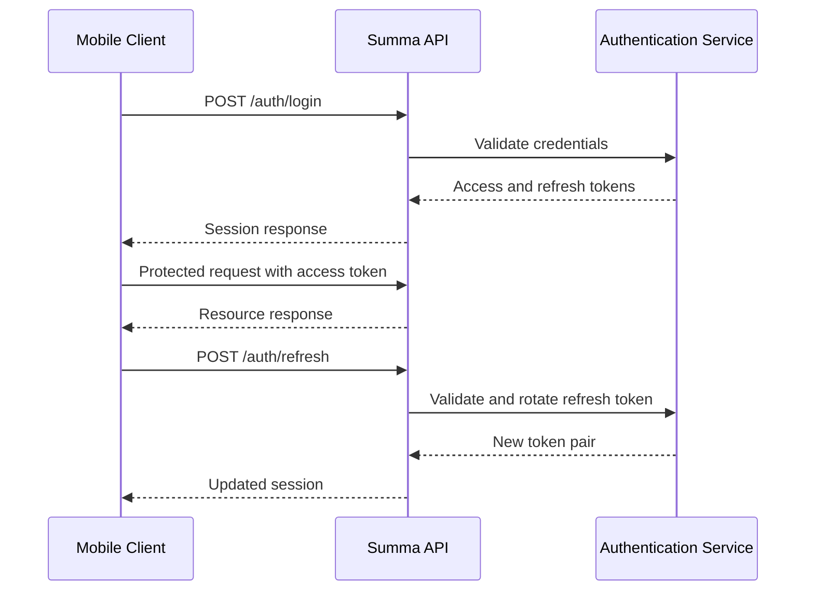

# API Design

> Defining the public HTTP API used by the Summa mobile applications, self-hosted server and Summa Cloud.

---

## Table of Contents

- [Purpose](#purpose)
- [Scope](#scope)
- [API Goals](#api-goals)
- [Core Principles](#core-principles)
- [Base URL](#base-url)
- [API Versioning](#api-versioning)
- [Transport and Content Type](#transport-and-content-type)
- [JSON Conventions](#json-conventions)
- [Resource Identifiers](#resource-identifiers)
- [Date and Time](#date-and-time)
- [Money Representation](#money-representation)
- [Authentication](#authentication)
- [Authorization](#authorization)
- [Request Headers](#request-headers)
- [Response Headers](#response-headers)
- [Response Format](#response-format)
- [Error Format](#error-format)
- [HTTP Status Codes](#http-status-codes)
- [Pagination](#pagination)
- [Filtering and Sorting](#filtering-and-sorting)
- [Idempotency](#idempotency)
- [Optimistic Concurrency](#optimistic-concurrency)
- [Resource Endpoints](#resource-endpoints)
- [Authentication Endpoints](#authentication-endpoints)
- [User Endpoints](#user-endpoints)
- [Device Endpoints](#device-endpoints)
- [Workspace Endpoints](#workspace-endpoints)
- [Profile Endpoints](#profile-endpoints)
- [Category Endpoints](#category-endpoints)
- [Transaction Endpoints](#transaction-endpoints)
- [Synchronization Endpoints](#synchronization-endpoints)
- [Attachment Endpoints](#attachment-endpoints)
- [Invitation Endpoints](#invitation-endpoints)
- [Health Endpoints](#health-endpoints)
- [Rate Limiting](#rate-limiting)
- [Security Requirements](#security-requirements)
- [Backward Compatibility](#backward-compatibility)
- [OpenAPI Documentation](#openapi-documentation)
- [Testing Requirements](#testing-requirements)
- [Definition of Done](#definition-of-done)
- [Guiding Principle](#guiding-principle)

---

## Purpose

This document defines the conventions and contracts of the Summa HTTP API.

The same API should be used by:

- Self-hosted Summa installations
- Summa Cloud
- Mobile application (Flutter — Android and iOS)
- Future desktop applications
- Future web applications
- Future command-line or integration clients

The API must remain consistent across self-hosted and managed deployments.

---

## Scope

This document covers:

- URL structure
- Request and response conventions
- Authentication
- Authorization
- Pagination
- Error handling
- Synchronization
- Resource naming
- API compatibility
- Versioning
- Rate limiting
- Idempotency

Detailed authentication security belongs in:

```text
docs/phase-0/06_SECURITY_MODEL.md
```

Detailed backend implementation belongs in:

```text
docs/phase-0/04_BACKEND_ARCHITECTURE.md
```

---

## API Goals

The Summa API should be:

- Predictable
- Secure
- Versioned
- Self-host friendly
- Easy to document
- Easy to test
- Compatible with mobile clients
- Suitable for unreliable networks
- Safe to retry
- Efficient for synchronization
- Independent of deployment provider

---

## Core Principles

### REST-Oriented

The API follows REST-oriented conventions.

Resources are represented using nouns.

Examples:

```text
/workspaces
/transactions
/categories
/devices
```

Avoid action-oriented endpoint names unless the operation cannot be represented clearly as a resource.

Good:

```text
POST /api/v1/workspaces
```

Avoid:

```text
POST /api/v1/createWorkspace
```

---

### Local-First

The API must not assume that clients are continuously connected.

Clients may:

- Remain offline for long periods
- Retry requests
- Upload delayed changes
- Synchronize large batches
- Send changes created on older application versions

The API must tolerate these conditions safely.

---

### Deployment-Neutral

The API contract must remain identical for:

- Self-hosted installations
- Summa Cloud

Cloud-specific infrastructure must not alter core resource behavior.

---

### Explicit Contracts

API behavior must be documented.

Clients should not depend on:

- Undocumented fields
- Implementation-specific error messages
- Database behavior
- Field ordering
- Internal identifiers

---

## Base URL

Self-hosted example:

```text
https://summa.example.com/api/v1
```

Summa Cloud example:

```text
https://api.summa.example/api/v1
```

Local development example:

```text
http://localhost:8080/api/v1
```

Production mobile clients should require HTTPS for remote servers.

---

## API Versioning

The API is versioned in the URL.

Initial version:

```text
/api/v1
```

Example:

```text
GET /api/v1/workspaces
```

A new major API version is introduced when a change cannot remain backward-compatible.

Example:

```text
/api/v2
```

Minor additive changes do not require a new URL version.

Examples of backward-compatible changes:

- Adding an optional response field
- Adding an optional request field
- Adding a new endpoint
- Adding a new enum value when clients are designed to tolerate unknown values

Examples of breaking changes:

- Removing a field
- Renaming a field
- Changing a field type
- Changing endpoint semantics
- Making an optional field mandatory
- Removing an accepted enum value

---

## Transport and Content Type

The API uses HTTP over TLS.

Default request and response format:

```text
application/json
```

Required request header:

```http
Content-Type: application/json
```

Preferred response header:

```http
Accept: application/json
```

File uploads may use:

```text
multipart/form-data
```

or a pre-authorized upload flow where appropriate.

---

## JSON Conventions

JSON field names use:

```text
snake_case
```

Example:

```json
{
  "workspace_id": "018e6c7c-1f52-7f91-a40f-6bff6a804002",
  "created_at": "2026-07-19T18:30:00Z",
  "transaction_type": "expense"
}
```

Reasons:

- Consistency with database naming
- Clear API readability
- Straightforward mapping in Dart and Go
- Predictable generated API documentation

---

## Null and Missing Fields

Missing and `null` values have different meanings.

A missing field means:

```text
The client did not provide or modify this value.
```

A `null` field means:

```text
The client explicitly clears this value.
```

This distinction is especially important for PATCH requests.

Example:

```json
{
  "note": null
}
```

This explicitly removes the existing note.

---

## Boolean Fields

Boolean fields must use JSON booleans.

Correct:

```json
{
  "is_active": true
}
```

Incorrect:

```json
{
  "is_active": "true"
}
```

---

## Enum Fields

Enum values use lowercase snake case.

Examples:

```text
expense
income
transfer
pending
synced
conflict
```

Clients should tolerate unknown future enum values where practical.

---

## Resource Identifiers

All externally visible resource identifiers use UUIDs.

Example:

```text
018e6c7c-1f52-7f91-a40f-6bff6a804002
```

Identifiers must be represented as strings in JSON.

Auto-increment integer identifiers must not be exposed publicly.

Client-created financial entities should use client-generated UUIDs to support offline creation.

Examples:

- Transactions
- Categories
- Profiles
- Budgets
- Attachments

Server-managed entities may use server-generated UUIDs.

Examples:

- Sessions
- Invitations
- Audit events

---

## Date and Time

All API timestamps use ISO 8601 in UTC.

Example:

```text
2026-07-19T18:30:00Z
```

All timestamp fields should end with `_at`.

Examples:

```text
created_at
updated_at
deleted_at
occurred_at
expires_at
last_seen_at
```

The API must not return local timezone-formatted timestamps.

Clients are responsible for displaying dates in the user's local timezone.

---

## Date-Only Values

Values representing calendar dates without time use:

```text
YYYY-MM-DD
```

Example:

```json
{
  "start_date": "2026-07-01",
  "end_date": "2026-07-31"
}
```

---

## Money Representation

Financial values must never use floating-point numbers.

Money is represented using:

- Integer amount in the smallest currency unit
- ISO 4217 currency code

Example:

```json
{
  "amount_minor": 125050,
  "currency": "RSD"
}
```

Meaning:

```text
1,250.50 RSD
```

Another example:

```json
{
  "amount_minor": 1099,
  "currency": "EUR"
}
```

Meaning:

```text
10.99 EUR
```

The API must not use:

```json
{
  "amount": 10.99
}
```

because floating-point values may introduce rounding errors.

---

## Authentication

Local-only mode does not use the API and requires no account.

Remote synchronization uses authentication.

Protected requests use Bearer access tokens.

Example:

```http
Authorization: Bearer <access_token>
```

Access tokens should be short-lived.

Refresh tokens are used to obtain new access tokens.

Refresh tokens must not be sent as Bearer authorization tokens.

---

## Authentication Flow



---

## Authorization

Authorization is workspace-based.

A valid access token does not automatically grant access to every resource.

For every protected workspace request, the server must validate:

1. The user is authenticated.
2. The workspace exists.
3. The user belongs to the workspace.
4. The user's role permits the requested action.
5. The requested entity belongs to that workspace.

Example:

```text
GET /api/v1/workspaces/{workspace_id}/transactions
```

The server must not trust `workspace_id` only because it was supplied by the client.

---

## Request Headers

Common request headers:

```http
Authorization: Bearer <token>
Content-Type: application/json
Accept: application/json
X-Request-ID: <uuid>
Idempotency-Key: <uuid>
X-Summa-Client-Version: 1.0.0
X-Summa-Platform: android
X-Summa-Device-ID: <uuid>
```

Not every endpoint requires every header.

---

## `X-Request-ID`

Clients may provide a unique request identifier.

Example:

```http
X-Request-ID: c975ab58-b61c-46a5-b072-ae91f4e77c68
```

If omitted, the server should generate one.

The response should return the final request identifier.

This identifier helps correlate:

- Client errors
- Server logs
- Background processing
- Support requests

---

## Client Version Headers

Clients should identify their application version and platform.

Example:

```http
X-Summa-Client-Version: 1.4.2
X-Summa-Platform: android
```

Supported platform values:

```text
android
ios
desktop
web
cli
```

These values may be used for:

- Compatibility checks
- Deprecation warnings
- Operational metrics
- Debugging

They must not be used to expose private financial information.

---

## Response Headers

Common response headers:

```http
Content-Type: application/json
X-Request-ID: c975ab58-b61c-46a5-b072-ae91f4e77c68
X-Summa-API-Version: 1
```

Optional rate-limit headers:

```http
RateLimit-Limit: 100
RateLimit-Remaining: 72
RateLimit-Reset: 60
```

Optional deprecation headers:

```http
Deprecation: true
Sunset: Wed, 31 Dec 2027 23:59:59 GMT
```

---

## Response Format

Successful single-resource responses use a `data` object.

Example:

```json
{
  "data": {
    "id": "018e6c7c-1f52-7f91-a40f-6bff6a804002",
    "name": "Personal",
    "created_at": "2026-07-19T18:30:00Z",
    "updated_at": "2026-07-19T18:30:00Z"
  }
}
```

Successful collection responses use `data` and `meta`.

Example:

```json
{
  "data": [
    {
      "id": "018e6c7c-1f52-7f91-a40f-6bff6a804002",
      "name": "Food"
    },
    {
      "id": "018e6c7c-1f52-7f91-a40f-6bff6a804003",
      "name": "Transport"
    }
  ],
  "meta": {
    "next_cursor": "eyJzZXF1ZW5jZSI6MTAwfQ",
    "has_more": true
  }
}
```

---

## Empty Responses

A successful delete may return:

```http
204 No Content
```

A successful list with no results returns:

```json
{
  "data": [],
  "meta": {
    "next_cursor": null,
    "has_more": false
  }
}
```

Empty collections are represented as empty arrays, not `null`.

---

## Error Format

All API errors use a consistent structure.

Example:

```json
{
  "error": {
    "code": "validation_error",
    "message": "The request contains invalid fields.",
    "details": [
      {
        "field": "amount_minor",
        "code": "must_be_greater_than_zero",
        "message": "Amount must be greater than zero."
      }
    ],
    "request_id": "c975ab58-b61c-46a5-b072-ae91f4e77c68"
  }
}
```

---

## Error Fields

| Field | Description |
|---|---|
| `code` | Stable machine-readable error identifier |
| `message` | Human-readable summary |
| `details` | Optional structured error details |
| `request_id` | Request correlation identifier |

Clients must use `code` for program logic.

Clients must not depend on exact human-readable messages.

---

## Standard Error Codes

Initial error codes:

```text
validation_error
authentication_required
invalid_credentials
token_expired
token_revoked
permission_denied
resource_not_found
resource_conflict
version_conflict
duplicate_resource
invalid_cursor
rate_limited
unsupported_client
unsupported_api_version
payload_too_large
attachment_type_not_allowed
storage_unavailable
service_unavailable
internal_error
```

---

## Validation Errors

Validation errors should identify invalid fields.

Example:

```json
{
  "error": {
    "code": "validation_error",
    "message": "The request contains invalid fields.",
    "details": [
      {
        "field": "currency",
        "code": "invalid_currency",
        "message": "Currency must be a supported ISO 4217 code."
      },
      {
        "field": "occurred_at",
        "code": "required",
        "message": "The transaction date is required."
      }
    ],
    "request_id": "3171e492-7fb1-435c-9d18-0d731fa77b82"
  }
}
```

---

## HTTP Status Codes

The API should use standard HTTP status codes consistently.

| Status | Usage |
|---|---|
| `200 OK` | Successful read or update |
| `201 Created` | Resource created |
| `202 Accepted` | Background operation accepted |
| `204 No Content` | Successful operation without response body |
| `400 Bad Request` | Invalid request structure |
| `401 Unauthorized` | Missing or invalid authentication |
| `403 Forbidden` | Authenticated but not authorized |
| `404 Not Found` | Resource does not exist or is not visible |
| `409 Conflict` | Resource or version conflict |
| `413 Payload Too Large` | Request or attachment exceeds limit |
| `415 Unsupported Media Type` | Unsupported content type |
| `422 Unprocessable Content` | Semantically invalid request |
| `429 Too Many Requests` | Rate limit exceeded |
| `500 Internal Server Error` | Unexpected server error |
| `503 Service Unavailable` | Required dependency unavailable |

The API must not return `200 OK` for failed operations.

---

## Resource Visibility

For protected resources, the server may return `404 Not Found` instead of `403 Forbidden` when revealing the existence of a resource would leak information.

Example:

A user requesting another workspace's transaction should not receive confirmation that the transaction exists.

---

## Pagination

Collection endpoints use cursor-based pagination.

Example:

```http
GET /api/v1/workspaces/{workspace_id}/transactions?limit=50&cursor=<cursor>
```

Response:

```json
{
  "data": [],
  "meta": {
    "next_cursor": "eyJpZCI6IjAxOGU2YyJ9",
    "has_more": true
  }
}
```

---

## Pagination Rules

- Default limit: `50`
- Maximum limit: `200`
- Cursors are opaque
- Clients must not parse cursors
- Invalid cursors return `400` or `422`
- Sorting must remain stable between pages
- Cursors may expire when explicitly documented

Offset pagination should not be used for large or frequently changing datasets.

---

## Filtering and Sorting

Query parameters use snake case.

Example:

```http
GET /api/v1/workspaces/{workspace_id}/transactions
    ?transaction_type=expense
    &category_id=<uuid>
    &occurred_from=2026-07-01T00:00:00Z
    &occurred_to=2026-08-01T00:00:00Z
    &sort=-occurred_at
```

A leading `-` indicates descending order.

Examples:

```text
sort=occurred_at
sort=-occurred_at
sort=name
```

Unsupported filters or sort fields should return a validation error.

---

## Idempotency

Requests that create resources or apply synchronization batches must support safe retries.

The client sends:

```http
Idempotency-Key: 97dbb4d8-f34a-4e73-b740-b7bda81826b0
```

The server associates the key with:

- Authenticated user or device
- Endpoint
- Request payload hash
- Stored result
- Expiration time

Repeating the same request with the same key returns the original result.

Using the same key with a different payload returns:

```http
409 Conflict
```

---

## Endpoints Requiring Idempotency

Idempotency should be supported for:

- Workspace creation
- Invitation creation
- Attachment initialization
- Synchronization push
- Account recovery operations
- Other retry-sensitive mutations

Client-generated UUIDs also reduce duplicate resource creation.

---

## Optimistic Concurrency

Mutable resources include a version number.

Example:

```json
{
  "id": "018e6c7c-1f52-7f91-a40f-6bff6a804002",
  "name": "Food",
  "version": 4,
  "updated_at": "2026-07-19T18:30:00Z"
}
```

An update includes the version the client last observed.

Example:

```json
{
  "name": "Groceries",
  "expected_version": 4
}
```

If the server version is no longer `4`, the server returns:

```http
409 Conflict
```

Example response:

```json
{
  "error": {
    "code": "version_conflict",
    "message": "The resource was modified by another client.",
    "details": [
      {
        "expected_version": 4,
        "current_version": 5
      }
    ],
    "request_id": "3511029f-d17f-43d1-9981-c116f77b4b0f"
  }
}
```

Synchronization endpoints may use a more specialized versioning model.

---

## Resource Endpoints

The API is organized around workspaces.

General structure:

```text
/api/v1/workspaces/{workspace_id}/{resource}
```

Examples:

```text
/api/v1/workspaces/{workspace_id}/profiles
/api/v1/workspaces/{workspace_id}/categories
/api/v1/workspaces/{workspace_id}/transactions
/api/v1/workspaces/{workspace_id}/attachments
```

Account-level resources are not workspace-scoped.

Examples:

```text
/api/v1/users/me
/api/v1/devices
/api/v1/auth/sessions
```

---

## Authentication Endpoints

### Register

```http
POST /api/v1/auth/register
```

Request:

```json
{
  "email": "user@example.com",
  "password": "example-password",
  "device": {
    "id": "6b29fc40-ca47-1067-b31d-00dd010662da",
    "name": "Danilo's Phone",
    "platform": "android"
  }
}
```

Response:

```json
{
  "data": {
    "user": {
      "id": "018e6c7c-1f52-7f91-a40f-6bff6a804002",
      "email": "user@example.com"
    },
    "session": {
      "access_token": "<token>",
      "refresh_token": "<token>",
      "access_token_expires_at": "2026-07-19T18:45:00Z"
    }
  }
}
```

---

### Login

```http
POST /api/v1/auth/login
```

Request:

```json
{
  "email": "user@example.com",
  "password": "example-password",
  "device": {
    "id": "6b29fc40-ca47-1067-b31d-00dd010662da",
    "name": "Danilo's Phone",
    "platform": "android"
  }
}
```

---

### Refresh Session

```http
POST /api/v1/auth/refresh
```

Request:

```json
{
  "refresh_token": "<refresh_token>"
}
```

The server should rotate the refresh token.

---

### Logout Current Session

```http
POST /api/v1/auth/logout
```

---

### Logout All Sessions

```http
POST /api/v1/auth/logout-all
```

---

### Request Password Reset

```http
POST /api/v1/auth/password-reset/request
```

---

### Confirm Password Reset

```http
POST /api/v1/auth/password-reset/confirm
```

---

## User Endpoints

### Current User

```http
GET /api/v1/users/me
```

### Update Current User

```http
PATCH /api/v1/users/me
```

### Delete Account

```http
DELETE /api/v1/users/me
```

Account deletion should require explicit confirmation and may be processed asynchronously.

---

## Device Endpoints

### List Devices

```http
GET /api/v1/devices
```

### Get Device

```http
GET /api/v1/devices/{device_id}
```

### Rename Device

```http
PATCH /api/v1/devices/{device_id}
```

### Revoke Device

```http
DELETE /api/v1/devices/{device_id}
```

Revoking a device invalidates its active sessions and refresh tokens.

---

## Workspace Endpoints

### List Workspaces

```http
GET /api/v1/workspaces
```

### Create Workspace

```http
POST /api/v1/workspaces
```

Request:

```json
{
  "name": "Family",
  "type": "household",
  "currency": "RSD"
}
```

### Get Workspace

```http
GET /api/v1/workspaces/{workspace_id}
```

### Update Workspace

```http
PATCH /api/v1/workspaces/{workspace_id}
```

### Delete Workspace

```http
DELETE /api/v1/workspaces/{workspace_id}
```

Workspace deletion should require owner permission and explicit confirmation.

---

## Workspace Member Endpoints

### List Members

```http
GET /api/v1/workspaces/{workspace_id}/members
```

### Update Member Role

```http
PATCH /api/v1/workspaces/{workspace_id}/members/{member_id}
```

### Remove Member

```http
DELETE /api/v1/workspaces/{workspace_id}/members/{member_id}
```

An owner must not accidentally remove the last owner without transferring ownership.

---

## Profile Endpoints

### List Profiles

```http
GET /api/v1/workspaces/{workspace_id}/profiles
```

### Create Profile

```http
POST /api/v1/workspaces/{workspace_id}/profiles
```

Request:

```json
{
  "id": "018e6c7c-1f52-7f91-a40f-6bff6a804002",
  "name": "Pera",
  "profile_type": "person"
}
```

### Get Profile

```http
GET /api/v1/workspaces/{workspace_id}/profiles/{profile_id}
```

### Update Profile

```http
PATCH /api/v1/workspaces/{workspace_id}/profiles/{profile_id}
```

### Delete Profile

```http
DELETE /api/v1/workspaces/{workspace_id}/profiles/{profile_id}
```

Deleting a profile with existing transactions requires a defined policy.

Possible strategies:

- Reject deletion
- Archive profile
- Require transaction reassignment

The final behavior must be specified before implementation.

---

## Category Endpoints

### List Categories

```http
GET /api/v1/workspaces/{workspace_id}/categories
```

### Create Category

```http
POST /api/v1/workspaces/{workspace_id}/categories
```

Request:

```json
{
  "id": "018e6c7c-1f52-7f91-a40f-6bff6a804003",
  "name": "Food",
  "category_type": "expense",
  "icon": "restaurant",
  "color": "#2C3E50"
}
```

### Get Category

```http
GET /api/v1/workspaces/{workspace_id}/categories/{category_id}
```

### Update Category

```http
PATCH /api/v1/workspaces/{workspace_id}/categories/{category_id}
```

### Delete Category

```http
DELETE /api/v1/workspaces/{workspace_id}/categories/{category_id}
```

Deleting categories referenced by transactions should archive the category or require reassignment.

---

## Transaction Endpoints

### List Transactions

```http
GET /api/v1/workspaces/{workspace_id}/transactions
```

### Create Transaction

```http
POST /api/v1/workspaces/{workspace_id}/transactions
```

Request:

```json
{
  "id": "018e6c7c-1f52-7f91-a40f-6bff6a804004",
  "profile_id": "018e6c7c-1f52-7f91-a40f-6bff6a804002",
  "category_id": "018e6c7c-1f52-7f91-a40f-6bff6a804003",
  "transaction_type": "expense",
  "amount_minor": 459900,
  "currency": "RSD",
  "merchant": "Supermarket",
  "note": "Weekly groceries",
  "occurred_at": "2026-07-19T17:15:00Z"
}
```

### Get Transaction

```http
GET /api/v1/workspaces/{workspace_id}/transactions/{transaction_id}
```

### Update Transaction

```http
PATCH /api/v1/workspaces/{workspace_id}/transactions/{transaction_id}
```

### Delete Transaction

```http
DELETE /api/v1/workspaces/{workspace_id}/transactions/{transaction_id}
```

Deletion should initially create a tombstone rather than permanently removing the record.

---

## Synchronization Endpoints

Synchronization uses dedicated batch endpoints.

### Push Local Changes

```http
POST /api/v1/workspaces/{workspace_id}/sync/push
```

Request:

```json
{
  "device_id": "6b29fc40-ca47-1067-b31d-00dd010662da",
  "batch_id": "4471fdf2-d51c-45be-b85e-46da95c2bdf8",
  "changes": [
    {
      "operation_id": "21344a52-3c3d-4d19-aea5-b902ad6b5412",
      "entity_type": "transaction",
      "entity_id": "018e6c7c-1f52-7f91-a40f-6bff6a804004",
      "operation": "upsert",
      "base_version": 3,
      "client_updated_at": "2026-07-19T17:15:00Z",
      "payload": {
        "profile_id": "018e6c7c-1f52-7f91-a40f-6bff6a804002",
        "category_id": "018e6c7c-1f52-7f91-a40f-6bff6a804003",
        "transaction_type": "expense",
        "amount_minor": 459900,
        "currency": "RSD",
        "occurred_at": "2026-07-19T17:15:00Z"
      }
    }
  ]
}
```

Response:

```json
{
  "data": {
    "batch_id": "4471fdf2-d51c-45be-b85e-46da95c2bdf8",
    "results": [
      {
        "operation_id": "21344a52-3c3d-4d19-aea5-b902ad6b5412",
        "entity_id": "018e6c7c-1f52-7f91-a40f-6bff6a804004",
        "status": "accepted",
        "server_version": 4
      }
    ]
  }
}
```

Possible synchronization statuses:

```text
accepted
rejected
conflict
duplicate
```

---

### Pull Remote Changes

```http
GET /api/v1/workspaces/{workspace_id}/sync/pull
    ?cursor=<cursor>
    &limit=500
```

Response:

```json
{
  "data": {
    "changes": [
      {
        "sequence": 1042,
        "entity_type": "transaction",
        "entity_id": "018e6c7c-1f52-7f91-a40f-6bff6a804004",
        "operation": "upsert",
        "version": 4,
        "server_updated_at": "2026-07-19T17:16:10Z",
        "payload": {
          "amount_minor": 459900,
          "currency": "RSD"
        }
      }
    ]
  },
  "meta": {
    "next_cursor": "eyJzZXF1ZW5jZSI6MTA0Mn0",
    "has_more": false
  }
}
```

---

## Synchronization Deletes

Deleted entities are returned as tombstones.

Example:

```json
{
  "sequence": 1043,
  "entity_type": "category",
  "entity_id": "018e6c7c-1f52-7f91-a40f-6bff6a804003",
  "operation": "delete",
  "version": 5,
  "deleted_at": "2026-07-19T17:20:00Z"
}
```

The client must preserve enough information to apply deletion safely.

---

## Initial Synchronization

A client with no cursor requests the initial dataset.

Example:

```http
GET /api/v1/workspaces/{workspace_id}/sync/pull?limit=500
```

The response may require multiple pages.

The client must continue until:

```json
{
  "has_more": false
}
```

---

## Synchronization Limits

Initial suggested limits:

- Maximum changes per push batch: `500`
- Default pull batch size: `200`
- Maximum pull batch size: `1000`
- Maximum serialized request size: configurable
- Maximum retry-safe idempotency retention: configurable

Final limits should be validated through performance testing.

---

## Attachment Endpoints

### Initialize Attachment

```http
POST /api/v1/workspaces/{workspace_id}/attachments
```

Request:

```json
{
  "id": "018e6c7c-1f52-7f91-a40f-6bff6a804005",
  "transaction_id": "018e6c7c-1f52-7f91-a40f-6bff6a804004",
  "file_name": "receipt.jpg",
  "mime_type": "image/jpeg",
  "size_bytes": 582144,
  "checksum_sha256": "..."
}
```

The server may respond with:

- Direct upload endpoint
- Pre-authorized object storage URL
- Attachment metadata

---

### Upload Attachment Content

Possible endpoint:

```http
PUT /api/v1/workspaces/{workspace_id}/attachments/{attachment_id}/content
```

Content type:

```text
application/octet-stream
```

or the original safe MIME type.

---

### Download Attachment

```http
GET /api/v1/workspaces/{workspace_id}/attachments/{attachment_id}/content
```

The server may return:

- File stream
- Short-lived signed download URL

Authorization must be checked before either response is issued.

---

### Delete Attachment

```http
DELETE /api/v1/workspaces/{workspace_id}/attachments/{attachment_id}
```

---

## Invitation Endpoints

### Create Invitation

```http
POST /api/v1/workspaces/{workspace_id}/invitations
```

Request:

```json
{
  "email": "member@example.com",
  "role": "member"
}
```

### List Invitations

```http
GET /api/v1/workspaces/{workspace_id}/invitations
```

### Cancel Invitation

```http
DELETE /api/v1/workspaces/{workspace_id}/invitations/{invitation_id}
```

### Accept Invitation

```http
POST /api/v1/invitations/{token}/accept
```

Invitation tokens must be:

- Random
- Time-limited
- Single-use
- Stored securely

---

## Health Endpoints

Liveness:

```http
GET /health/live
```

Example response:

```json
{
  "status": "ok"
}
```

Readiness:

```http
GET /health/ready
```

Example response:

```json
{
  "status": "ready",
  "checks": {
    "database": "ok",
    "storage": "ok",
    "migrations": "ok"
  }
}
```

Health responses must not expose secrets or internal infrastructure details.

---

## Service Information Endpoint

Optional endpoint:

```http
GET /api/v1/server/info
```

Possible response:

```json
{
  "data": {
    "version": "1.2.0",
    "api_versions": [1],
    "deployment_type": "self_hosted",
    "capabilities": [
      "sync",
      "attachments",
      "workspace_sharing"
    ],
    "minimum_supported_client_version": "1.0.0"
  }
}
```

This endpoint helps clients determine server compatibility.

It must not expose sensitive configuration.

---

## Rate Limiting

Rate limits should be stricter for security-sensitive endpoints.

Examples:

```text
POST /auth/login
POST /auth/register
POST /auth/password-reset/request
POST /auth/refresh
POST /invitations
```

Synchronization endpoints may require higher limits but should still be protected against abuse.

---

## Rate Limit Response

Status:

```http
429 Too Many Requests
```

Response:

```json
{
  "error": {
    "code": "rate_limited",
    "message": "Too many requests. Try again later.",
    "details": [
      {
        "retry_after_seconds": 60
      }
    ],
    "request_id": "468b7513-4047-4f30-a5df-9ebdd2438074"
  }
}
```

Optional header:

```http
Retry-After: 60
```

---

## Security Requirements

The API must:

- Require HTTPS in production
- Validate all input
- Enforce authorization server-side
- Limit request size
- Limit attachment size
- Avoid logging sensitive request bodies
- Reject unsupported content types
- Use safe error messages
- Rotate refresh tokens
- Support device revocation
- Protect authentication endpoints from brute force attacks
- Prevent cross-workspace access
- Avoid exposing internal stack traces
- Avoid returning secret configuration

---

## CORS

CORS is primarily relevant for future web clients.

Self-hosted deployments should configure allowed origins explicitly.

Default production behavior should not allow unrestricted origins.

Avoid:

```http
Access-Control-Allow-Origin: *
```

for authenticated browser access.

Native mobile applications are not governed by browser CORS rules.

---

## Backward Compatibility

Mobile clients and self-hosted servers may update at different times.

The API must support a defined compatibility window.

Servers should communicate unsupported clients clearly.

Example:

```json
{
  "error": {
    "code": "unsupported_client",
    "message": "This application version is no longer supported.",
    "details": [
      {
        "minimum_supported_version": "1.4.0",
        "current_version": "1.2.0"
      }
    ],
    "request_id": "17c9fa8b-5e89-4ae8-8501-3982d8fc1500"
  }
}
```

The server must not silently accept requests it cannot process correctly.

---

## Deprecation Policy

Before removing an API capability:

1. Mark it as deprecated.
2. Document the replacement.
3. Return deprecation headers where appropriate.
4. Support both versions during the compatibility period.
5. Publish the planned removal version.
6. Provide migration instructions.

Self-hosted users require sufficient time to upgrade.

---

## OpenAPI Documentation

The API must maintain an OpenAPI specification.

Recommended location:

```text
backend/api/openapi.yaml
```

The OpenAPI document should define:

- Endpoints
- Request schemas
- Response schemas
- Error schemas
- Authentication
- Pagination
- Examples
- Enum values
- Required fields
- Deprecations

The implementation and specification must remain synchronized.

---

## Generated Clients

The OpenAPI specification may later be used to generate:

- Dart API models
- TypeScript clients
- Documentation website
- Contract tests

Generated code should not replace domain models directly.

Transport models and domain models should remain separate where necessary.

---

## Testing Requirements

Every endpoint must have tests covering:

- Successful request
- Validation failure
- Missing authentication
- Invalid authentication
- Missing authorization
- Resource not found
- Workspace isolation
- Invalid payload
- Unsupported content type
- Rate-limit behavior where relevant

---

## Contract Tests

Contract tests should verify:

- OpenAPI specification matches implementation
- Required fields remain stable
- Error structures remain consistent
- Enum values are documented
- API version headers are present
- Pagination behavior is stable
- Idempotency works correctly
- Synchronization retries do not create duplicates

---

## Synchronization Tests

Synchronization tests must cover:

- Initial synchronization
- Incremental synchronization
- Duplicate push batch
- Duplicate operation
- Offline edits
- Simultaneous edits
- Edit versus delete
- Deleted resource tombstones
- Invalid cursor
- Expired cursor
- Multiple pages
- Server interruption
- Client retry
- Workspace isolation

---

## Definition of Done

The API design is considered ready for implementation when:

- Base URL conventions are approved
- JSON naming conventions are approved
- Money representation is finalized
- Authentication flow is documented
- Authorization boundaries are documented
- Error format is finalized
- Pagination format is finalized
- Idempotency rules are defined
- Synchronization endpoints are agreed upon
- Attachment flow is defined
- Versioning policy is approved
- OpenAPI location is defined
- Critical contract tests are identified

---

## Guiding Principle

The Summa API must remain predictable under normal operation, unreliable networks and repeated requests.

It should provide the same contract regardless of whether the user chooses self-hosting or Summa Cloud.

The API exists to synchronize user-owned data safely, not to make the application dependent on a remote service.