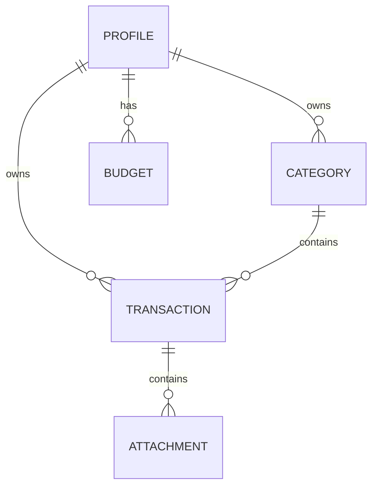

# Database Design

> Designing a scalable, local-first database architecture for Summa.

---

# Table of Contents

- Purpose
- Design Goals
- Database Philosophy
- Storage Strategy
- Naming Conventions
- Entity Overview
- Entity Relationships
- Core Entities
- Synchronization Fields
- Indexing Strategy
- Soft Delete Strategy
- Migration Strategy
- Future Expansion

---

# Purpose

This document defines the database architecture used throughout the Summa ecosystem.

The mobile application stores all data locally using SQLite.

Future phases introduce synchronization with a PostgreSQL backend while maintaining compatibility with the local schema.

---

# Database Philosophy

The database should be:

- Simple
- Predictable
- Extensible
- Offline-first
- Synchronization-friendly

The database is the source of truth.

The UI is only a representation of database state.

---

# Design Goals

The schema should support:

- Multiple local profiles
- Personal finances
- Shared finances
- Categories
- Budgets
- Statistics
- Imports
- OCR
- Synchronization
- Future cloud support

without requiring breaking changes.

---

# Storage Strategy

Phase 1

SQLite

↓

Room

Future

SQLite

↓

Sync Engine

↓

REST API

↓

PostgreSQL

Both databases should share nearly identical schemas.

---

# Naming Conventions

Tables

snake_case

Examples

profiles

transactions

categories

budgets

Attachments

Columns

snake_case

Examples

created_at

updated_at

profile_id

category_id

deleted_at

Primary Keys

UUID

Never auto-increment integers.

Reason:

UUIDs simplify synchronization between devices.

---

# Common Fields

Almost every entity contains:

id

created_at

updated_at

deleted_at

version

sync_status

These fields make future synchronization easier.

---

# Entity Overview

```

Profile

│

├── Categories

│

├── Transactions

│

├── Budgets

│

└── Attachments

```

---

# Entity Relationship Diagram



---

# Entity: Profile

Represents one financial identity.

Examples:

- Personal
- Family
- Roommates
- Friends

Fields

| Column | Type |
|---------|------|
| id | UUID |
| name | TEXT |
| type | TEXT |
| currency | TEXT |
| created_at | DATETIME |
| updated_at | DATETIME |

---

# Entity: Category

Represents expense or income categories.

Examples

Food

Transport

Salary

Entertainment

Fields

| Column | Type |
|---------|------|
| id | UUID |
| profile_id | UUID |
| name | TEXT |
| icon | TEXT |
| color | TEXT |
| type | TEXT |

---

# Entity: Transaction

The central entity of the application.

Fields

| Column | Type |
|---------|------|
| id | UUID |
| profile_id | UUID |
| category_id | UUID |
| amount | DECIMAL |
| transaction_type | TEXT |
| note | TEXT |
| merchant | TEXT |
| occurred_at | DATETIME |
| created_at | DATETIME |
| updated_at | DATETIME |

---

Transaction Types

- Expense
- Income
- Transfer

Future:

- Adjustment

---

# Entity: Budget

Represents spending limits.

Fields

| Column | Type |
|---------|------|
| id | UUID |
| profile_id | UUID |
| category_id | UUID |
| amount | DECIMAL |
| period | TEXT |

---

# Entity: Attachment

Stores references to files.

Examples

- Receipt image
- Invoice
- PDF

Fields

| Column | Type |
|---------|------|
| id | UUID |
| transaction_id | UUID |
| file_name | TEXT |
| mime_type | TEXT |
| local_path | TEXT |

---

# Synchronization Fields

Every synchronized entity contains:

version

Incremented after every modification.

sync_status

Possible values:

- Local
- Pending
- Synced
- Conflict

device_id

Identifies the device that created the record.

deleted_at

Soft delete timestamp.

---

# Soft Delete Strategy

Records are never immediately deleted.

Instead:

deleted_at receives a timestamp.

Advantages

- Easier synchronization
- Better recovery
- Audit capability

Permanent deletion may happen later through cleanup.

---

# Indexing Strategy

Indexes should exist on:

profile_id

category_id

occurred_at

transaction_type

sync_status

Indexes should only be added where performance benefits justify additional storage.

---

# Migration Strategy

Room migrations should always be used.

Database version increases whenever:

- Table changes
- Column changes
- Constraints change

Destructive migrations are forbidden in production.

---

# Backup Strategy

Exports include:

- JSON
- CSV
- Excel

Future:

Encrypted backup archive.

---

# Future Entities

Planned entities include:

RecurringTransaction

Reminder

Subscription

BankStatement

OCRDocument

Notification

Workspace

User

Invitation

AuditLog

SyncEvent

These entities are intentionally excluded from Phase 1.

---

# Database Principles

The database should remain:

- Predictable
- Normalized where practical
- Easy to migrate
- Easy to synchronize
- Easy to understand

Complexity should be introduced only when necessary.